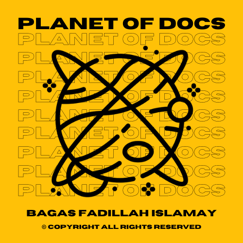
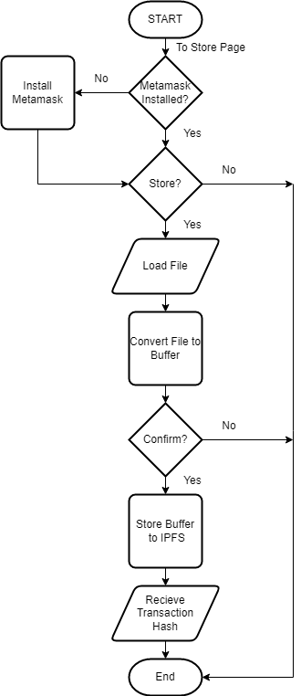
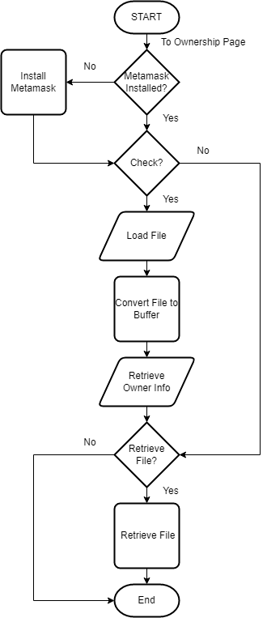
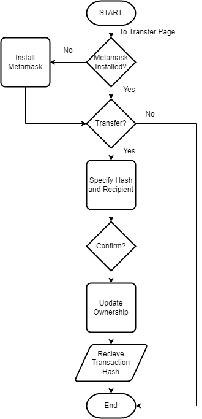
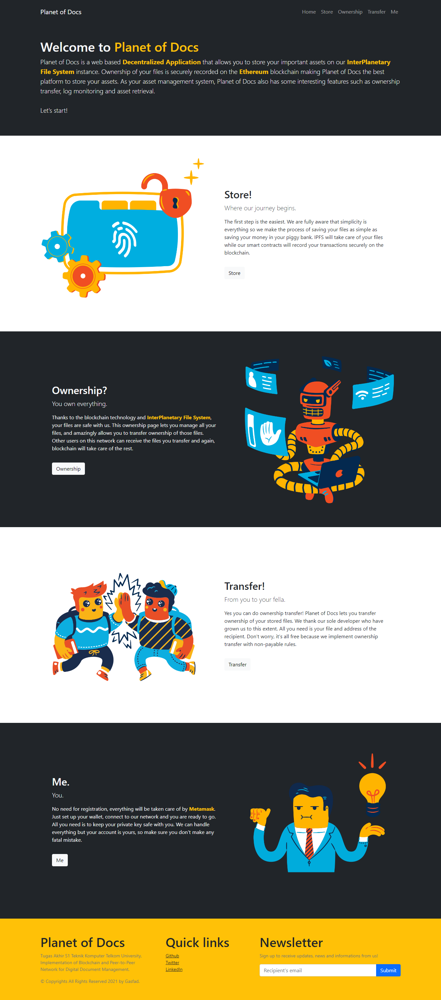
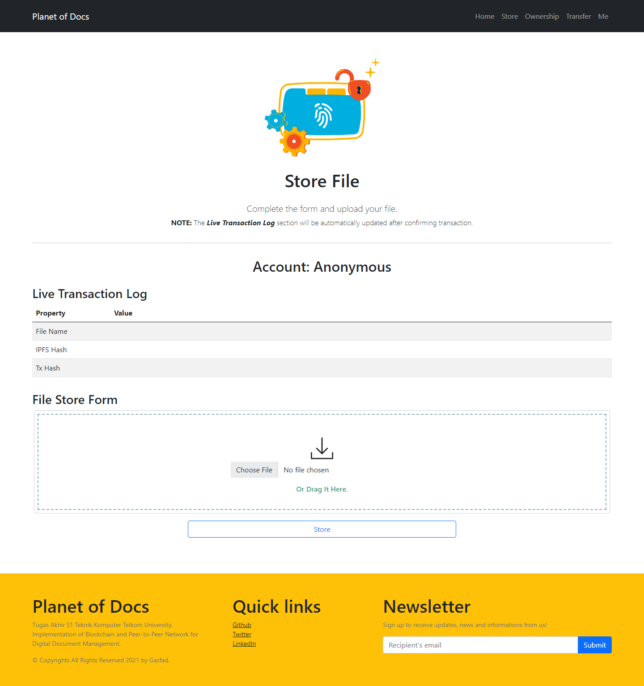
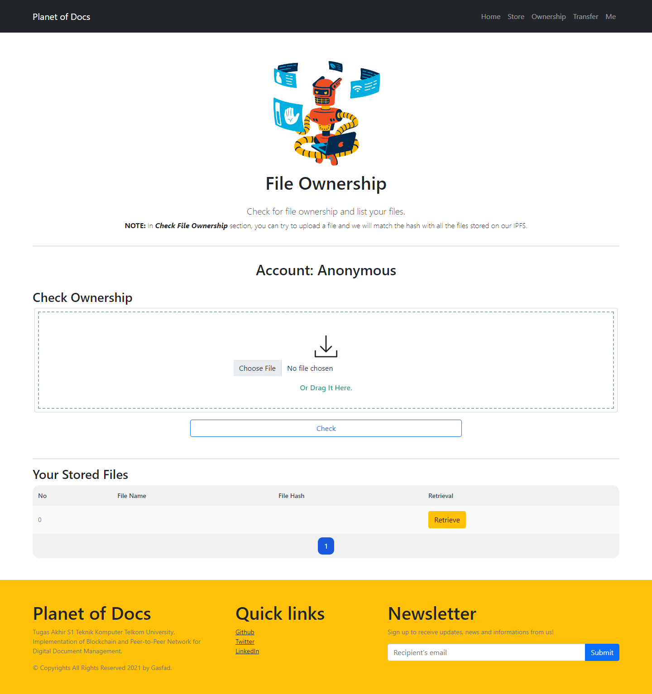
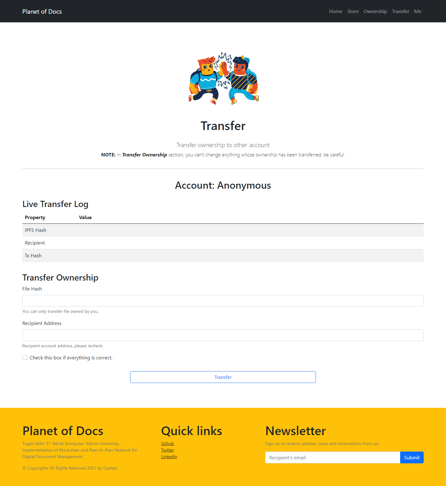
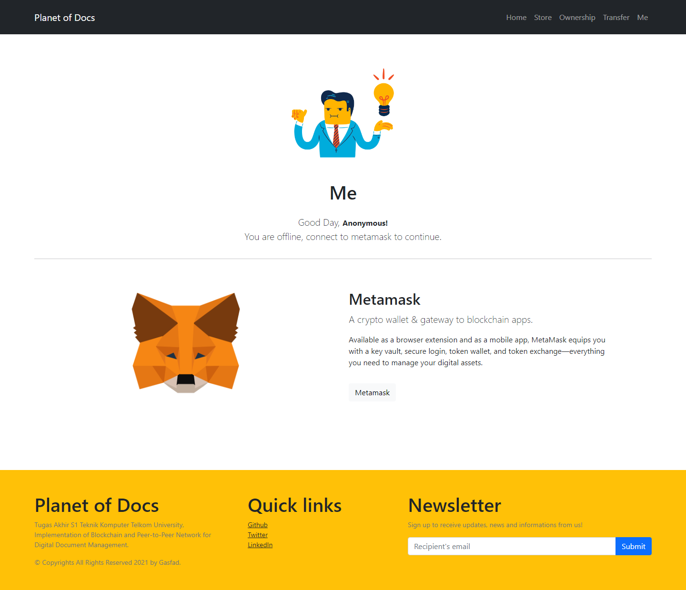
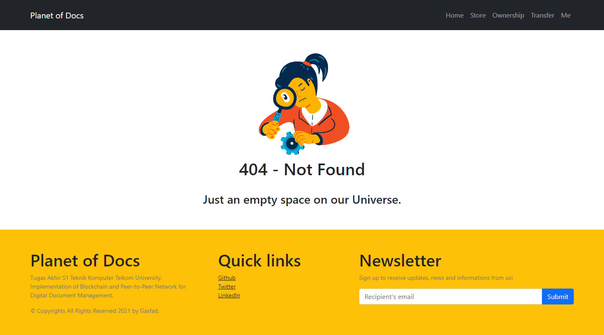

# Planet of Docs

<p align="center">
  
</p>

## Description

A web-based DApp (Decentralized Application) that can record all kinds of digital document management operations. This application was created as a digital document management platform that focuses on maintaining the integrity value of every digital document processed in this application. The application consists of 3 main features, namely “Store”, “Ownership” and “Transfer”. This DApp take advantage of Solidity smart contracts, InterPlanetary File System (IPFS), React and web3.js.

## Disclaimer

I am not a developer. I only studied Solidity for 3 days, studied React from a 2 hour crash course and wrote the whole code for 2 weeks (although I have 4 months to develop this app, I'm a busy person :sunglasses:). I don't have time to do a perfect test so this app may have a lot of bugs in it. Very apologize for that. Use at your own risk.

## Features

The store feature is a feature for uploading
files to IPFS which is both a create operation on the application
and write operation on the blockchain. The ownership feature
can check the ownership of the uploaded file while allowing
users to be able to retrieve files that have been saved, this is an
implementation of read operations on the application and on
the blockchain. The transfer feature allows users to be able
to make ownership transfers of files that have been previously
stored, this illustrates the implementation of update operation on
the application and write operation on the blockchain.

<details><summary>Store</summary>
<p>
In the Store feature, system flow starts from the Metamask
check for account selection. Furthermore, the user can perform
store operation by affixing the file to the form on the web
interface, the application then converts the file into a buffer,
user confirms the transaction and proceed with storing the
file to IPFS. As output, the user will get information in the
form of file hash and transaction hash.
<p align="center">
  
</p>
</p>
</details>

<details><summary>Ownership</summary>
<p>
Furthermore, the functionality of the Ownership feature is
also started by checking the Metamask account. Followed by
the choice of whether the user wants to check the ownership
of a file or not. If so, the user can add the file that he wants to
find out the owner of, but if the user does not want to check
the ownership then the user can continue with the file retrieval
feature. In the file retrieval feature, users only need to click
the “Retrieve” button to retrieve the files they own.

<p align="center">
  
</p>
</p>
</details>

<details><summary>Transfer</summary>
<p>
As in the previous featurse flow, the Transfer feature also
starts with a Metamask account check. Then users who wish to
transfer ownership of their files can provide information on the
destination account to be transferred, followed by confirming
the transaction. The end result of this feature is the loss of
the file entry that has been transferred and the receipt of the
transfer transaction hash as proof that the ownership has been
transferred. 

<p align="center">
  
</p>
</p>
</details>

## Tech Stack

- Blockchain: Ethereum
- Smart Contract: Solidity ^0.8.0
- Front-end: React + Boostrap 5 UI + web3.js
- IPFS: ipfs-api + Infura
- Project Template: [React Truffle Box](https://trufflesuite.com/boxes/react/index.html)

## Deployment

Execute the steps below sequentially.

<details><summary>NPM</summary>
<p>

From **root** directory: `npm install`

From **client** directory: `npm install`

</p>
</details>

<details><summary>Truffle Compile and Migrate</summary>
<p>

First, create a *truffle-config.js* file for Windows or just *truffle.js* for Linux file in the **root** directory, paste in below code and modify it as per your requirement:

```javascript
const path = require("path");
const HDWalletProvider = require("@truffle/hdwallet-provider");
const mnemonic = "CHANGE THIS VALUE WITH YOUR METAMASK ACCOUNT MNEMONIC";
module.exports = {
  // See <http://truffleframework.com/docs/advanced/configuration>
  // to customize your Truffle configuration!
  contracts_build_directory: path.join(__dirname, "client/src/contracts"),
  networks: {
    // Configuration for mainnet
    mainnet: {
      provider: function () {
        // Setting the provider with the Infura Mainnet address and Token
        return new HDWalletProvider(mnemonic, "https://mainnet.infura.io/v3/YOUR_TOKEN")
      },
      network_id: "1"
    },
    // Configuration for rinkeby network
    rinkeby: {
      // Special function to setup the provider
      provider: function () {
        // Setting the provider with the Infura Rinkeby address and Token
        return new HDWalletProvider(mnemonic, "https://rinkeby.infura.io/v3/YOUR_TOKEN")
      },
      // Network id is 4 for Rinkeby
      network_id: 4
    },
    ganache: {
      host: "127.0.0.1",
      port: 7545,
      network_id: "*"
    }
  },
  compilers: {
    solc: {
      version: "^0.8.0"
    }
  }

};
```

Then from root folder:
- Ganache Deploy: `truffle migrate --network ganache --reset --compile all`
- Rinkeby Deploy: `truffle migrate --network rinkeby --reset --compile all`

</p>
</details>

<details><summary>Local Test</summary>
<p>

`npm start` from *client* directory or if you want to build it, then you should execute `npm build` (notice the <b>build</b> directory). Finally, run it using [Serve](https://www.npmjs.com/package/serve) with `serve -s build` from *client* directory.

</p>
</details>

## Gallery

Home Page               |
:----------------------:|
  |

Store Page              |Ownership Page              |Transfer Page               |
:----------------------:|:--------------------------:|:--------------------------:|
 | |  |

Me Page               |
:--------------------:|
  |

Not Found Page              |
:--------------------------:|
  |

## Copyright

Tugas Akhir - S1 Teknik Komputer Semester Ganjil 2021/2022

© Copyright All Rights Reserved - Bagas Fadillah Islamay (2022)


